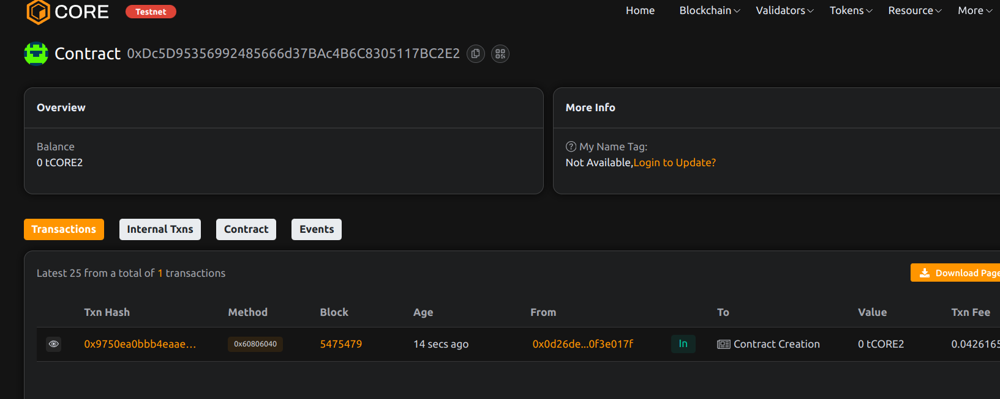

# DAONameService: Human-Readable DAO Naming and Resolution System

## Project Description
DAONameService provides a decentralized naming system for DAOs, transforming complex wallet addresses into human-readable names. This system improves user experience by making DAOs easily identifiable and verifiable while maintaining all the security benefits of blockchain addresses.

## Project Vision
Our vision is to create a universal naming standard for DAOs that enhances discoverability and trust in the decentralized ecosystem. DAONameService aims to become the DNS equivalent for decentralized organizations, making Web3 more accessible to mainstream users.

## Key Features
- Simple name registration for DAOs
- Human-readable name resolution
- Immutable registration records
- Address-name bidirectional mapping
- Descriptive metadata storage
- Owner-controlled updates

## Future Scope
- Name expiration and renewal system
- Subdomain support
- Name marketplace
- Reputation system integration
- Multi-chain name resolution
- Verification badges for known DAOs

## Contract Details
0xDc5D95356992485666d37BAc4B6C8305117BC2E2
